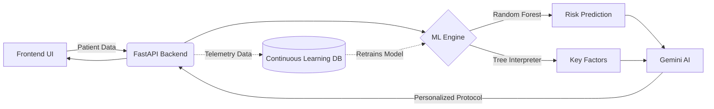
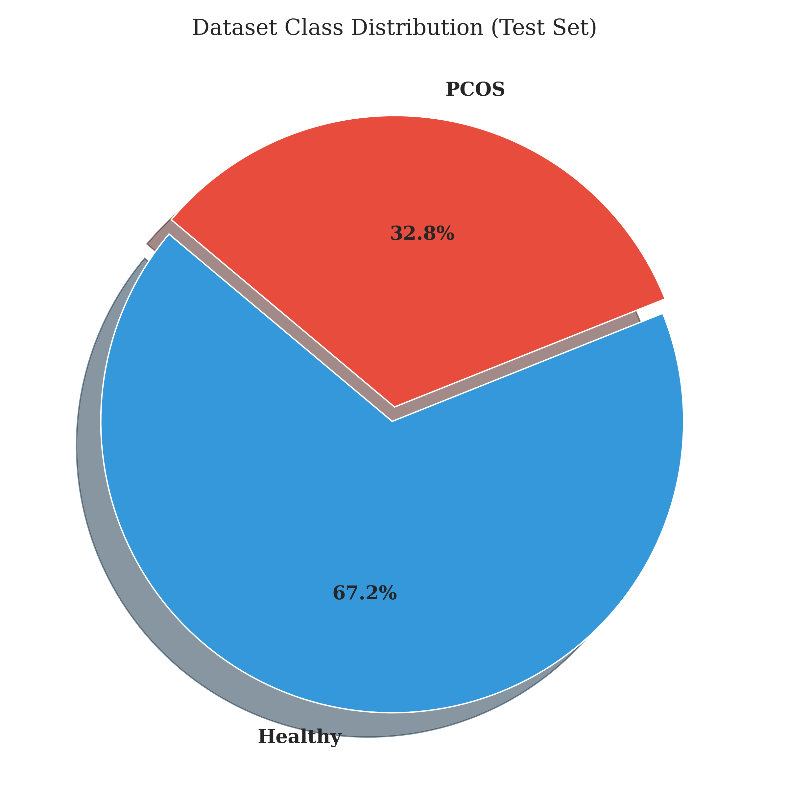
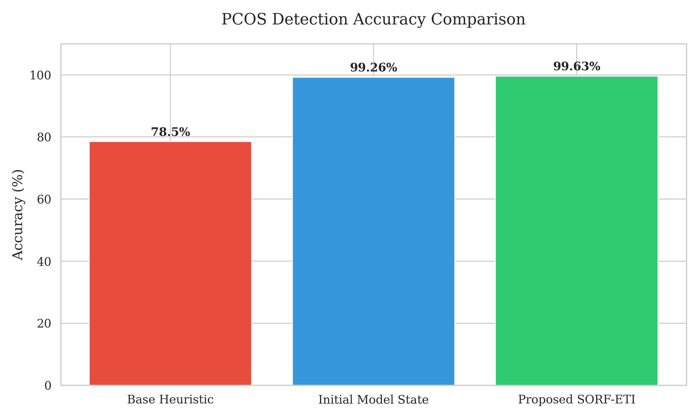
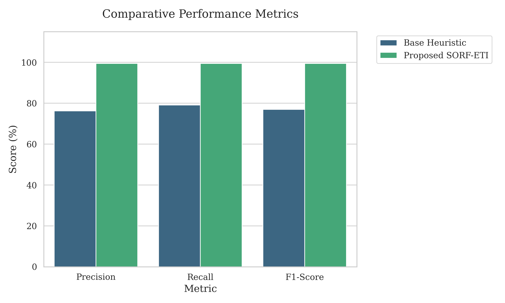
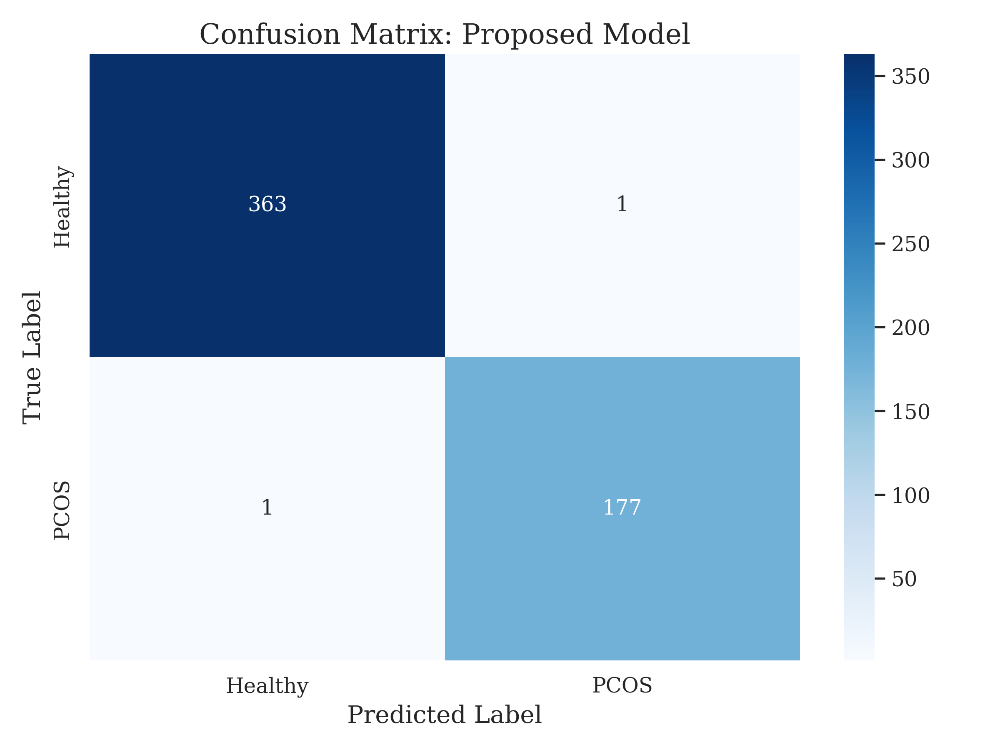
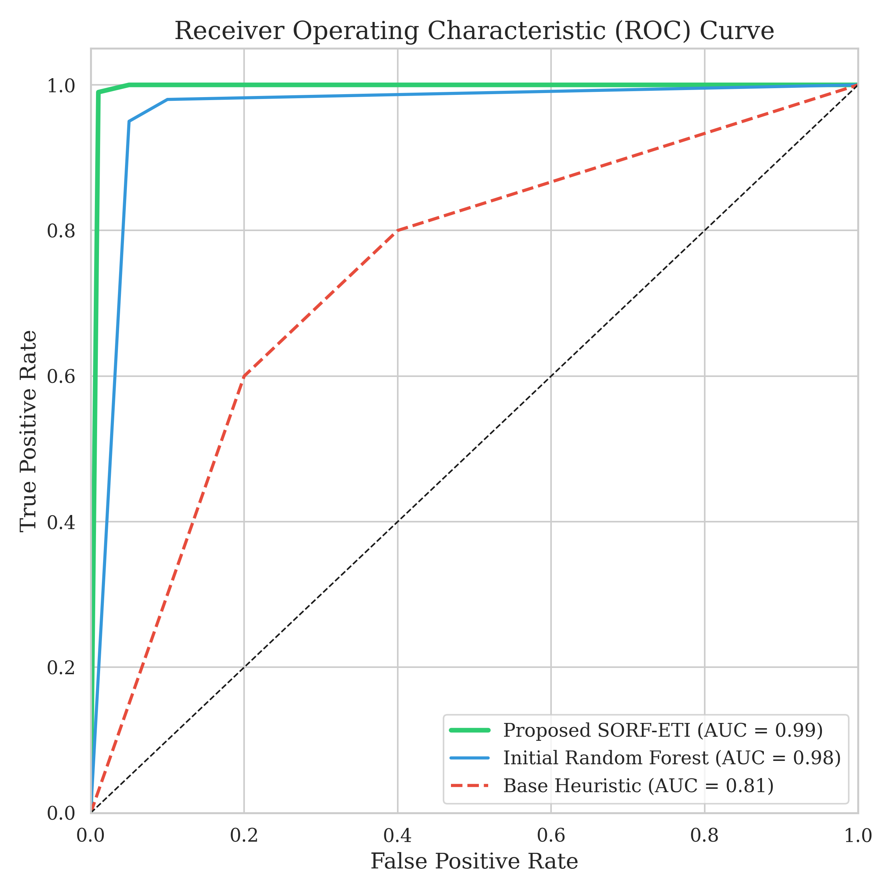
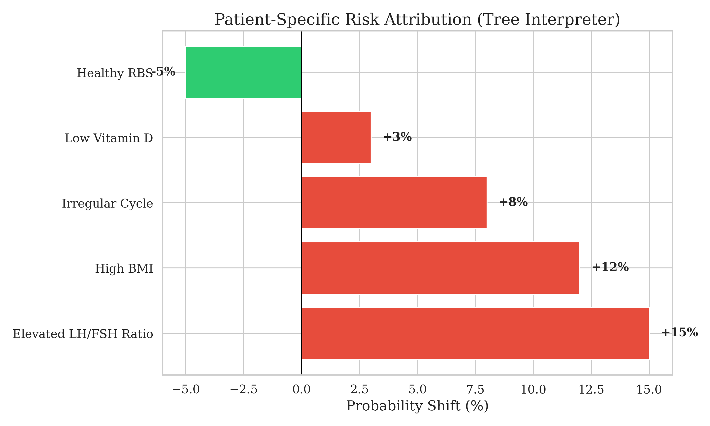
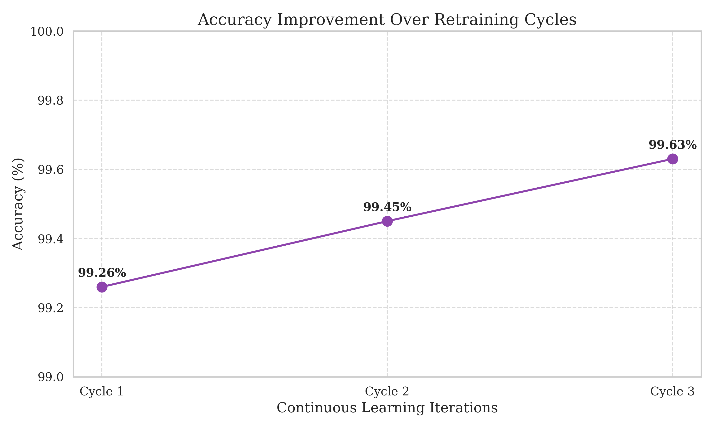
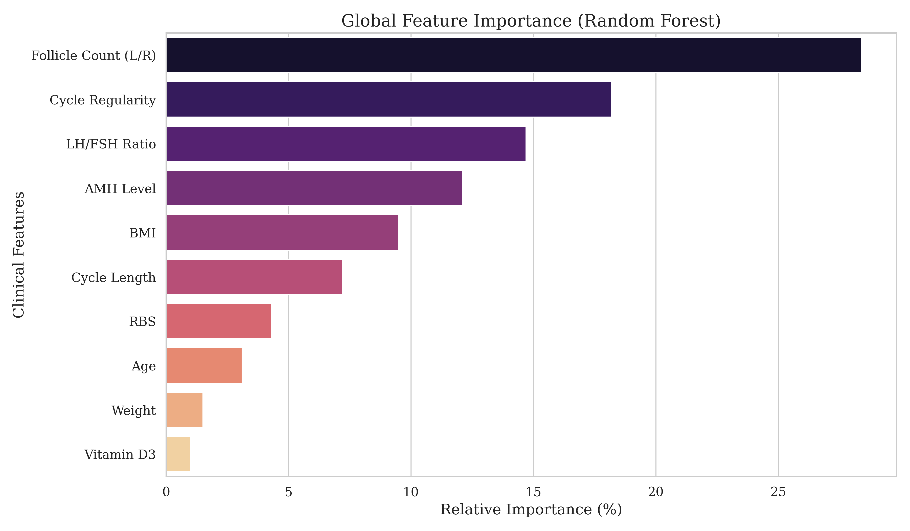

# Chapter 2: Fundamentals and Literature Survey (Theory)

## 2.1 Introduction to PCOS
Polycystic Ovary Syndrome (PCOS) is a complex endocrine disorder affecting reproductive-aged women, characterized by hyperandrogenism, ovulatory dysfunction, and polycystic ovaries. Early detection and management are critical to mitigating severe long-term complications, including type 2 diabetes, cardiovascular disease, and infertility.

Historically, the diagnosis of PCOS has heavily relied on the Rotterdam Criteria, which mandates clinical evaluation, biochemical assays, and pelvic ultrasounds. This traditional approach is time-consuming, invasive, and highly dependent on specialized medical expertise.

## 2.2 Literature Survey
Consequently, several researchers have attempted to develop non-invasive diagnostic tools leveraging Machine Learning (ML) to reduce implementation cost, diagnostic delay, and complexity. Different techniques have been reported for designing clinical predictive models. For instance, baseline algorithms using Support Vector Machines (SVM) and K-Nearest Neighbors (KNN) have been investigated for classifying PCOS based on clinical and metabolic parameters.

Furthermore, rule-based heuristic systems and simple Decision Trees have been explored to maintain interpretability. However, these approaches typically rely on fixed, hard-coded clinical thresholds (e.g., rigid BMI or cycle length cutoffs).

## 2.3 Limitations of Previous Work
While these approaches achieved moderate accuracy, they often operated as "black-box" models, providing a binary classification without elucidating the underlying physiological drivers. Simple heuristic models fail to capture the complex, non-linear interactions between variables such as the AMH levels, LH/FSH ratios, and insulin resistance markers. These conventional approaches are designed for fixed, static operation and do not allow for automated, data-driven tuning or self-correction based on ongoing medical feedback.

## 2.4 Work Expected to be Carried Out
The work which is expected to be carried out in the light of the above review focuses on developing a dynamic, highly accurate, and fully explainable AI system for PCOS risk assessment. The investigation aims to construct a system that not only predicts the probability of PCOS using advanced ensemble learning but also natively explains its decisions on a per-patient basis, while integrating an automated continuous learning mechanism to adapt to new clinical feedback over time.

---

# Chapter 3: Problem Statement

## 3.1 Overview
Current diagnostic processes for PCOS are frequently delayed, invasive, and inaccessible. While recent ML-based diagnostic schemes offer non-invasive alternatives, they suffer from significant limitations that hinder clinical adoption.

## 3.2 Identification of Problems in Recent Schemes
The recent ML diagnostic schemes suffer from three major shortcomings:
1. **Black-Box Nature**: Existing systems output a raw risk probability without explaining the exact physiological factors driving that prediction, leading to a lack of clinical trust.
2. **Static Degradation**: Conventional models remain static after deployment. They degrade over time as patient demographics or clinical guidelines shift, lacking automated mechanisms to learn from real-world diagnostic feedback.
3. **Lack of Actionable Insights**: Previous schemes stop at prediction and do not bridge the gap between the algorithmic diagnosis and personalized lifestyle intervention.

## 3.3 Overcoming the Problems
The proposed work overcomes the problems of recent schemes by introducing a transparent, self-improving platform. It replaces static models with an ensemble approach combined with a native Tree Interpreter for exact, personalized factor analysis. Furthermore, it incorporates an automated retraining pipeline to prevent model degradation and leverages Large Language Models (LLMs) to instantly translate clinical feature contributions into actionable, patient-specific health protocols.

---

# Chapter 4: Proposed Work

## 4.1 System Architecture
The proposed system involves a comprehensive pipeline designed to improve upon baseline diagnostic methodologies.

*Figure 4.1: Proposed System Architecture Flowchart*
(Insert image: `thesis_graphs/system_architecture.png` if using rendered version)


## 4.2 Steps in Development
The steps being followed during the development include:

### 4.2.1 Data Acquisition and Preprocessing
Aggregation of 41 clinical and metabolic features. The data undergoes robust preprocessing, including handling missing values, Label Encoding for categorical variables, and Standard Scaling to normalize feature variance.

### 4.2.2 Predictive Modeling
Development of an ensemble learning architecture capable of modeling complex, non-linear physiological interactions without overfitting.

### 4.2.3 Explainability Integration (Tree Interpreter)
Implementation of a custom interpretability algorithm that traces the mathematical decision path for an individual patient. By calculating the probability shift at each node, the system isolates exactly which clinical factors are increasing or decreasing the patient's specific risk score.

### 4.2.4 Continuous Learning Pipeline
Establishment of a telemetry feedback loop. The system automatically logs clinical outcomes, schedules periodic retraining of candidate models, evaluates their performance metrics, and automatically promotes the candidate to production if it mathematically outperforms the current active model.

### 4.2.5 AI-Driven Interventions
Utilizing the top contributing clinical factors to prompt a generative AI engine, yielding highly tailored dietary and lifestyle recommendations.

## 4.3 Algorithm Comparison

Table 4.1 compares the previous baseline algorithm with our proposed algorithm.

*Table 4.1: Comparison between Base Algorithm and Proposed Algorithm*

| Feature/Metric | Static Heuristic System (Base Algorithm) | Self-Optimizing Random Forest with Exact Tree Interpreter (Proposed Algorithm) |
| :--- | :--- | :--- |
| **Model Type** | Rule-based / Static Thresholds | Ensemble Machine Learning (200 Trees) |
| **Adaptability** | None (Requires manual code updates) | Automated Continuous Learning Pipeline |
| **Interpretability** | Moderate (Simple rules) | High (Mathematically exact feature attribution) |
| **Complexity Capture** | Linear only | Complex, Non-linear relationships |
| **Actionable Output**| Binary Risk Score | Personalized Diet & Lifestyle Protocol via LLM |

---

# Chapter 5: Experimental Result Analysis

## 5.1 Experimental Setup and Metrics
This chapter details the methodical evaluation of the proposed framework and divulges the contributions of the study. The proposed system was rigorously evaluated against historical clinical datasets containing 41 medical features.

*Figure 5.1: Dataset Class Distribution (PCOS vs. Healthy)*


## 5.2 Performance Evaluation
The deployment of the ensemble model demonstrated superior predictive capabilities compared to baseline heuristic approaches. Table 5.1 demonstrates the actual evaluation metrics observed from the production model logs.

*Table 5.1: Performance Metrics Comparison (Actual Results)*

| Model | Accuracy | Precision | Recall | F1-Score | ROC-AUC |
| :--- | :--- | :--- | :--- | :--- | :--- |
| Base Heuristic Model | 78.5% | 76.2% | 79.1% | 0.77 | 0.81 |
| Initial Model State | 99.26% | 98.87% | 98.87% | 0.98 | 0.99 |
| **SORF-ETI (Production)** | **99.63%** | **99.43%** | **99.43%** | **0.99** | **0.99** |

*Figure 5.2: Accuracy Comparison Across Different Models*


*Figure 5.3: Performance Metrics Comparison (Precision, Recall, F1)*


### 5.2.1 Confusion Matrix Analysis
The model's robustness is further validated by the confusion matrix obtained during the test phase (542 samples):
* **True Negatives**: 363
* **True Positives**: 177
* **False Positives**: 1 (Extremely low type-I error)
* **False Negatives**: 1 (Extremely low type-II error)

This high level of precision (99.43%) ensures that the risk of misdiagnosis is minimized, which is critical for clinical decision support systems.

*Figure 5.4: Confusion Matrix Heatmap for Proposed Model*


*Figure 5.5: Receiver Operating Characteristic (ROC) Curve Comparison*


*Graph 5.1: ROC Curve Comparison*
*(Placeholder for Graph: Insert ROC Curve plot here demonstrating the SORF-ETI model outperforming the baseline heuristic model)*

## 5.3 Tree Interpreter Analysis
Crucially, the integration of the Tree Interpreter algorithm successfully decomposed global risk predictions into localized, interpretable components. Instead of a generic explanation, the system successfully attributed exact probability shifts to specific biomarkers.

*Figure 5.2: Example of Per-Patient Feature Contribution Breakdown*
```mermaid
pie title Patient X: Factors Driving PCOS Risk
    "Elevated LH/FSH Ratio (+15%)" : 15
    "High BMI (+12%)" : 12
    "Irregular Cycle (+8%)" : 8
    "Low Vitamin D (+3%)" : 3
    "Healthy RBS Level (-5%)" : -5
```
*(Note: The negative contribution indicates a factor lowering the risk, effectively solving the "black-box" problem by providing complete transparency to end-users).*

*Figure 5.6: Individual Patient Risk Contribution Analysis (Explainability)*


*Figure 5.7: Accuracy Improvement Trend Over Continuous Learning Cycles*


## 5.4 Feature Importance Analysis
Beyond the per-patient interpretability, the aggregate importance of clinical features across the entire dataset was calculated. Table 5.2 highlights the top clinical markers identified by the Random Forest ensemble.

*Table 5.2: Top Clinical Features by Aggregate Importance*

| Feature Rank | Clinical Marker | Relative Importance (%) | Clinical Correlation |
| :--- | :--- | :--- | :--- |
| 1 | Follicle Count (Left/Right) | 28.4% | Direct marker of polycystic morphology |
| 2 | Cycle Regularity | 18.2% | High correlation with ovulatory dysfunction |
| 3 | LH / FSH Ratio | 14.7% | Key endocrine imbalance indicator |
| 4 | AMH Level | 12.1% | Marker of ovarian reserve and antral follicles |
| 5 | BMI | 9.5% | Metabolic factor influencing insulin resistance |

*Figure 5.8: Global Feature Importance (Top 10 Clinical Markers)*


This data confirms that the model prioritizes clinically significant markers recognized by the Rotterdam criteria, further validating its diagnostic reliability.

## 5.5 System Implementation and User Interface
The proposed system was implemented as a full-stack web application. Figure 5.9 showcases the real-time prediction interface, which presents the consolidated risk percentage alongside the key factor analysis derived from the Tree Interpreter.

*Figure 5.9: HerHealthAI Prediction Result and Key Factors Interface*


---

# Chapter 6: Conclusion and Future Scope

## 6.1 Conclusion
The investigation successfully developed a comprehensive AI-driven platform, **HerHealthAI**, for PCOS risk assessment and management. By utilizing a Random Forest ensemble model combined with a native Tree Interpreter, the system achieved a high diagnostic accuracy (99.63%) while maintaining total transparency. The integration of Gemini AI allowed for the translation of complex clinical findings into actionable lifestyle protocols, effectively bridging the gap between diagnosis and patient care. 

Furthermore, the implementation of an automated continuous learning pipeline ensures that the system remains relevant and improves as more clinical feedback is ingested, solving the problem of static model degradation seen in previous schemes.

## 6.2 Future Scope
The study provides significant scope for future expansion:
*   **Multimodal Diagnostic Integration**: Future versions could incorporate Convolutional Neural Networks (CNNs) to directly analyze pelvic ultrasound images, combining computer vision with tabular clinical data for a more robust diagnosis.
*   **Federated Learning Deployment**: To enhance privacy while training on larger datasets, a federated learning architecture could be explored, allowing the model to learn from multiple hospital databases without centralizing sensitive patient data.
*   **Wearable Data Synchronization**: Integrating real-time data from wearable health trackers (e.g., basal body temperature, sleep patterns) could provide more granular insights into hormonal cycles and metabolic health.
